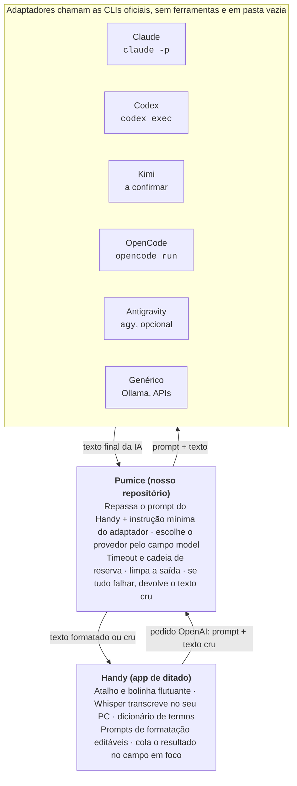
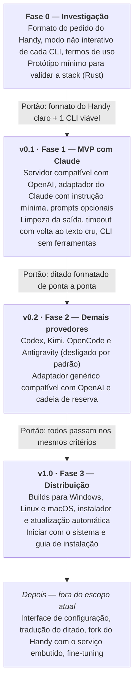

# Pumice — Planejamento

> **Cópia do documento de produto.** A fonte da verdade é o documento de produto em português, mantido fora do repositório. Este arquivo é uma cópia dele, atualizada junto com a tradução em inglês ([`spec.md`](spec.md)). Agentes de IA não editam este arquivo.
>
> Data da cópia: 2026-10-03.

## Visão e objetivo

Um serviço local que recebe o texto transcrito pelo Whisper, faz uma correção leve com a IA escolhida e devolve o texto pronto para colar. O primeiro cliente é o Handy, mas o serviço expõe uma API no padrão OpenAI e serve a qualquer app de ditado.

O diferencial é usar as CLIs das assinaturas que o usuário já paga (Claude, Codex, Kimi, Antigravity e OpenCode), sem exigir chaves de API cobradas à parte.

Nome: Pumice (pedra-pomes, usada para polir).

## Contexto e decisões já tomadas

A base de ditado é o Handy, e o serviço nasce como repositório próprio, sem fork nesta fase.

- **Handy como base:** licença MIT, feito em Tauri/Rust. Transcreve localmente com Whisper, tem overlay e atalho, aceita modelos GGML próprios e tem pós-processamento via endpoint compatível com OpenAI (em alpha, como recurso experimental).
- **Integração:** o provedor "Custom" do Handy aponta para o serviço local.
- **Prompts moram no Handy:** desde a versão 0.9.8, o Handy tem vários prompts com nome, editáveis na interface, e um prompt padrão que já corrige o texto, mantém o idioma e ignora instruções dentro do ditado. O Pumice repassa o prompt que recebe. O system prompt e o prompt do usuário do Pumice são opcionais e ficam desligados por padrão.
- **Dicionário de termos:** usa o recurso nativo do Handy. O serviço não duplica.
- **Assinaturas sempre pela CLI oficial:** nunca extrair tokens de login para usar fora dela.
- **Plataformas:** o desenvolvimento e os testes locais acontecem no Linux (WSL). O alvo principal de uso é o Windows, validado manualmente depois, e a stack roda nos três sistemas desde o início. A validação no Windows não exige instalar nada nele agora.
- **Stack: Rust.** Gera um executável único para os três sistemas, e o usuário não precisa instalar Rust nem nenhum outro runtime (no Windows, o runtime de C vai embutido no executável) e é a mesma linguagem do Handy, o que facilita embutir o serviço num fork. Na Fase 3, o Tauri (mesmo framework do Handy) traz instalador e atualização automática.
- **Tempo de resposta:** até 30 s no total, como meta inicial.
- **Idioma:** o texto volta no mesmo idioma em que foi ditado.

## Regras do projeto

O que é para máquinas e para a comunidade fica em inglês; o que é para pensar o produto pode ficar em português.

- **Fonte da verdade:** este documento, em português. A versão em inglês para os agentes é derivada dele e só é atualizada quando pedido. Mudanças de produto sempre começam aqui.
- **Inglês:** código, nomes de variáveis, comentários, commits, README e especificações para os agentes de IA. Isso evita a mistura de idiomas, gasta menos tokens e alcança a comunidade do Handy.
- **Nome do projeto:** em inglês, sem "Whisper" no nome.
- **Configuração:** um arquivo YAML, validado ao iniciar, com a linha exata em caso de erro. Prompts longos usam o bloco de várias linhas do YAML. Tudo tem um valor padrão: o YAML só precisa trazer o que o usuário quer mudar.
- **Regras para agentes:** um único `AGENTS.md` na raiz. Codex, OpenCode e Kimi já usam esse arquivo, e o Claude Code passou a lê-lo quando não há `CLAUDE.md`. Por isso, não criar `CLAUDE.md`.
- **Ambiente de desenvolvimento:** Linux (WSL). Nenhuma ferramenta precisa ser instalada no Windows nesta fase.
- **Licença:** MIT.
- **Commits:** padrão Conventional Commits (`feat:`, `fix:`, `docs:` etc.).
- **Versões:** SemVer (0.1, 0.2… até a 1.0).
- **Changelog:** um `CHANGELOG.md` no formato Keep a Changelog, gerado a partir dos commits a cada versão.
- **Testes:** todo adaptador é testável com uma CLI falsa. Localmente, os testes rodam no Linux; no CI (GitHub Actions), rodam a cada mudança nos três sistemas.

## Escopo

O serviço só formata o ditado: corrige de leve e organiza listas. Nada de reescrever o texto em outro formato.

**Dentro**

- Correção leve: erros de transcrição, pontuação e um ajuste leve de contexto
- Listas quando o usuário enumera itens
- API compatível com OpenAI
- Adaptadores para Claude, Codex, Kimi, Antigravity e OpenCode
- Adaptador genérico compatível com OpenAI (Ollama, LM Studio ou APIs com chave)
- Instrução mínima por adaptador + prompts opcionais do Pumice
- Timeout, provedor reserva e volta ao texto cru
- CLIs rodando sem ferramentas
- Arquivo de configuração
- Windows, Linux e macOS

**Fora, por enquanto**

- Perfis por tipo de texto (e-mail, mensagem etc.)
- Estilo por aplicativo
- Modo comando
- Interface gráfica
- Fork do Handy
- Fine-tuning do Whisper
- Tradução do ditado (ideia futura: receber qualquer idioma e devolver no idioma escolhido)

## Arquitetura

O Handy não muda: o provedor Custom dele aponta para o Pumice, e cada CLI vira um adaptador independente atrás dele.

## Épicos e histórias de usuário

São nove épicos, de E0 a E8. Cada história tem um ID para o agente referenciar e critérios de aceite logo abaixo.

### E0 — Investigação

1. **S0.1 Formato do pedido do Handy.** Como desenvolvedor, quero capturar o pedido bruto que o Handy envia ao endpoint Custom, para saber o que implementar.
   - Registrar rota, cabeçalhos e corpo de um pedido real
   - Confirmar se o Handy chama `/v1/models` e se pede saída estruturada
   - Confirmar como o Handy envia o prompt: tudo como mensagem do usuário ou com uma mensagem de sistema separada
   - Confirmar se o Handy pede a resposta em streaming
   - Confirmar se o Handy informa o idioma do ditado
2. **S0.2 Modo não interativo de cada CLI.** Como desenvolvedor, quero saber como chamar cada CLI sem interação, para definir os adaptadores.
   - Para cada CLI: comando, como passar o system prompt, como desligar as ferramentas e o formato da saída
   - Claude (`claude -p`), Codex (`codex exec`), Antigravity (`agy -p`), OpenCode (`opencode run` e um eventual modo servidor) e Kimi (a confirmar)
   - Medir a latência a frio e, se houver modo servidor, a quente
3. **S0.3 Termos de uso.** Como usuário, quero saber se chamar cada CLI oficial para uso pessoal é permitido, para não arriscar minhas contas.
   - Registrar a regra e os limites de cota de cada provedor
4. **S0.4 Validar a stack.** Como desenvolvedor, quero confirmar com um protótipo mínimo que Rust atende ao projeto.
   - Chamar uma CLI a partir de Rust e ler a resposta, no Linux
   - Compilar para Windows, Linux e macOS e confirmar que o executável roda numa máquina limpa, sem nada instalado
   - Registrar o caminho para instalador e atualização automática (Tauri)
5. **S0.5 Handy no Windows, Pumice no WSL.** Como usuário, quero usar o Handy instalado no Windows com o Pumice e as CLIs rodando no WSL, sem instalar nada no Windows.
   - Confirmar que o Handy no Windows alcança o Pumice no WSL pelo `localhost`
   - Se funcionar, esse é o primeiro jeito de usar o MVP no dia a dia

### E1 — Servidor compatível com OpenAI

1. **S1.1 Formatar pelo Handy.** Como usuário, quero apontar o Handy para o serviço local e receber o texto formatado no lugar do cru.
   - `POST /v1/chat/completions` aceita o pedido do Handy e responde no formato OpenAI
   - O serviço só escuta em localhost
2. **S1.2 Listar provedores.** Como usuário, quero escolher o provedor na lista de modelos do Handy.
   - `GET /v1/models` devolve os provedores configurados como "modelos"
3. **S1.3 Status.** Como usuário, quero verificar se o serviço está no ar.
   - Uma rota simples de saúde responde OK
4. **S1.4 Log de depuração.** Como desenvolvedor, quero registrar o pedido bruto quando precisar investigar.
   - Desligado por padrão e ligado pela configuração
5. **S1.5 Porta padrão.** Como usuário, quero que o serviço funcione sem configurar porta, e poder trocar se precisar.
   - A porta padrão vem embutida no programa; o YAML só a sobrescreve
   - Escolher uma porta entre 1024 e 49151, sem registro na IANA e longe das usadas por ferramentas de IA comuns (1234 do LM Studio, 11434 do Ollama, 7860 em diante do Gradio)
   - Se a porta estiver ocupada, o serviço para com um erro claro dizendo como trocar no YAML

### E2 — Adaptadores de CLI

1. **S2.1 Interface comum.** Como desenvolvedor, quero que todo provedor siga a mesma interface, para adicionar um novo sem mexer no núcleo.
   - Entrada: system prompt, prompt do usuário e texto. Saída: texto final ou erro
   - Um provedor novo = um módulo novo
2. **S2.2 Claude** via `claude -p`, com o system prompt separado quando a CLI permitir.
3. **S2.3 Codex** via `codex exec`.
4. **S2.4 Kimi** via a CLI do Kimi, conforme o resultado de S0.2.
5. **S2.5 Antigravity** via `agy`, desligado por padrão e com aviso de risco.
6. **S2.6 OpenCode** via `opencode run` ou modo servidor, com opção de usar modelos gratuitos do Zen.
7. **S2.7 Genérico** para qualquer API compatível com OpenAI (Ollama, LM Studio ou APIs com chave).
8. **S2.8 Detecção automática (v0.2).** Como usuário, quero que o Pumice descubra sozinho quais CLIs estão instaladas, para não configurar à mão.
   - Ao iniciar, procura cada CLI suportada no PATH e lê a versão
   - `/v1/models` lista só os provedores disponíveis; o Antigravity continua desligado por padrão mesmo se encontrado
   - Um comando `pumice doctor` mostra o que foi encontrado, o que falta e como instalar
   - O teste de login de verdade só roda quando o usuário pede no `doctor`, porque gasta cota e tempo

Critérios comuns a todos os adaptadores:

- Devolve só o texto final
- Dá um erro claro quando a CLI não está instalada ou não está logada

### E3 — Prompts e limpeza da saída

1. **S3.1 Instrução mínima do adaptador.** Como usuário, quero que a CLI se comporte como um processador de texto, não como um assistente de programação.
   - Cada adaptador acrescenta uma instrução fixa e curta: devolver só o texto resultante, sem comentários
   - Com o prompt padrão do Handy, ditar "escreve um e-mail pro João" devolve a frase formatada, não um e-mail
2. **S3.2 Prompts opcionais do Pumice.** Como usuário de outro app de ditado, quero poder definir um system prompt e um prompt do usuário no próprio Pumice.
   - Desligados por padrão; quando ligados, valem para todos os provedores
   - Configurados no YAML
3. **S3.3 Combinação.** O serviço junta a instrução do adaptador, os prompts opcionais e as mensagens recebidas. Usa o campo de system prompt da CLI quando ele existe; quando não existe, junta tudo num texto só.
4. **S3.4 Limpeza.** O serviço remove tags de raciocínio, preâmbulos como "Aqui está…", cercas de código e espaços sobrando.

### E4 — Confiabilidade

1. **S4.1 Timeout por provedor**, configurável. O tempo total máximo padrão é de 30 s.
2. **S4.2 Cadeia de reserva.** Uma lista ordenada de provedores: se um falha ou estoura o tempo, o serviço tenta o próximo.
3. **S4.3 Nunca perder o ditado.** Como usuário, quero receber pelo menos o texto cru quando tudo falhar.
   - Com a CLI desinstalada, o Handy cola o texto cru dentro do timeout total configurado

### E5 — Segurança

1. **S5.1 CLIs sem ferramentas.** Sem acesso a arquivos, shell ou web. Quando a CLI não deixar desligar, usar o modo mais restrito disponível.
2. **S5.2 Pasta vazia.** Cada chamada roda numa pasta temporária vazia.
3. **S5.3 Rede.** O serviço só escuta em localhost e não tem telemetria.

### E6 — Configuração

1. **S6.1 Arquivo único** com provedores, ordem de reserva, timeouts, prompts opcionais e porta.
2. **S6.2 Provedor pelo campo `model`.** O valor escolhido no Handy define o provedor; vazio cai no provedor padrão.
3. **S6.3 Recarregar a configuração sem reiniciar** (desejável).
4. **S6.4 Arquivo de exemplo.** O projeto traz um YAML de exemplo, comentado e pronto para copiar.

### E7 — Instalação e multiplataforma

1. **S7.1 Builds** para Windows, Linux e macOS.
2. **S7.2 Iniciar com o sistema** nos três sistemas.
3. **S7.3 Guia de instalação:** instalar o serviço, logar nas CLIs e configurar o Handy.
4. **S7.4 Instalador e atualização.** Como usuário, quero instalar com um instalador e ser avisado quando houver versão nova, para atualizar com um clique.
5. **S7.5 Changelog automático.** Como usuário, quero ver o que mudou em cada versão.
   - Gerado a partir dos commits a cada versão
   - O mesmo texto aparece no aviso de atualização (S7.4)

### E8 — Qualidade

1. **S8.1 Exemplos de ditado.** Como usuário, quero um conjunto de 10 a 20 ditados reais com o resultado esperado, para comparar provedores e ajustar o prompt.
   - Inclui listas, correções no meio da frase e termos técnicos
2. **S8.2 CLI falsa.** Como desenvolvedor, quero testar os adaptadores sem chamar CLIs de verdade.
3. **S8.3 Testes automáticos** a cada mudança, nos três sistemas.

## Fases

Cada fase começa quando o portão anterior é cumprido.

A Fase 1 entrega o fluxo completo com um único provedor; os demais entram só depois que ele funciona de ponta a ponta.

## Riscos e pontos em aberto

O maior risco é a latência das CLIs: elas são agentes e demoram a iniciar. A Fase 0 mede isso antes de construir.

| Risco | Impacto | Mitigação |
| --- | --- | --- |
| CLIs demoram a responder | Ditado formatado lento | Medir em S0.2; modo servidor quando existir; timeout com volta ao texto cru; adaptador genérico para modelos rápidos |
| Antigravity: modo não interativo instável e relatos de contas banidas por automação | Perda da conta Google | Desligado por padrão, com aviso na documentação |
| Termos de uso mudam (a Anthropic já restringiu tokens de assinatura fora das apps oficiais; segundo relatos de jun/2026, o `claude -p` usa uma cota separada) | Adaptador para de funcionar ou viola os termos | Sempre a CLI oficial, nunca extrair tokens; revisar em S0.3 |
| Pós-processamento do Handy ainda em alpha | O formato do pedido pode mudar | Log de pedido bruto (S1.4) e testes de contrato |
| Modo não interativo do Kimi não verificado | Adaptador inviável | Confirmar em S0.2; alternativa: modelos Kimi pelo OpenCode Go |
| A IA obedece ao ditado em vez de formatar | Texto errado colado | Prompt padrão do Handy, instrução do adaptador e o teste de aceite da S3.1 |
| CLIs com ferramentas executam ações no PC | Risco de segurança | Épico E5 |

**Decisões**

- [x] Nome do projeto: Pumice
- [x] Stack: Rust (validar em S0.4)
- [x] Formato do arquivo de configuração: YAML
- [x] Meta de tempo: até 30 s
- [ ] Número da porta padrão (critérios em S1.5)

## Referências

- [Handy — GitHub](https://github.com/cjpais/Handy)
- [Handy — documentação do pós-processamento](https://handy.computer/docs/post-processing)
- [Engineer's Codex — política de assinaturas da Anthropic](https://engineerscodex.com/anthropic-claude-subscription-switcharoo)
- [GIGAZINE — Anthropic proíbe tokens de assinatura em apps de terceiros](https://gigazine.net/gsc_news/en/20260220-anthropic-third-party-block)
- [Tech Insider — linha do tempo das restrições](https://tech-insider.org/ie/?p=560)
- [handoff-mcp — uso headless do Codex e do Antigravity](https://glama.ai/mcp/servers/felkru/handoff-mcp/tree)
- [unified-cli — riscos de automatizar o agy](https://pypi.org/project/unified-cli/)
- [opencode-see-image — modelos gratuitos do Zen](https://github.com/alfaoz/opencode-see-image)
- [OpenClaw — catálogo do OpenCode Go](https://docs.openclaw.ai/providers/opencode-go.md)
- [Simon Willison — Claude Code lê o AGENTS.md](https://simonwillison.net/2026/Sep/18/thariq-shihipar/)
