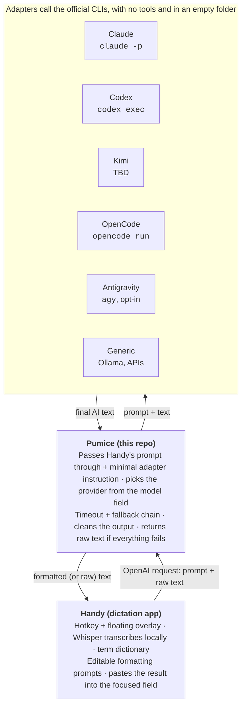
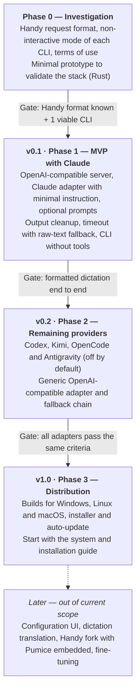

# Pumice — Product Spec

> **Derived document.** This is the English translation of the product doc, whose source of truth is written in Portuguese (a snapshot lives at [`product.pt-BR.md`](product.pt-BR.md)). Do not edit this file directly: product changes start in the Portuguese doc, and this translation is regenerated on request.
>
> Snapshot date: 2026-10-03.

## Vision and goal

Pumice is a local service that receives text transcribed by Whisper, lightly corrects it with an AI of the user's choice, and returns text ready to paste. The first client is [Handy](https://github.com/cjpais/Handy), but the service exposes an OpenAI-compatible API and works with any dictation app.

What sets it apart is using the CLIs of subscriptions the user already pays for (Claude, Codex, Kimi, Antigravity and OpenCode), instead of requiring separately billed API keys.

Name: Pumice (the volcanic stone used for polishing).

## Context and decisions already made

Handy is the dictation front end, and Pumice is its own repository, with no fork at this stage.

- **Handy as the base:** MIT licensed, built with Tauri/Rust. It transcribes locally with Whisper, has an overlay and a hotkey, accepts custom GGML models, and offers post-processing through an OpenAI-compatible endpoint (alpha, behind an experimental toggle).
- **Integration:** Handy's "Custom" provider points to the local service.
- **Prompts live in Handy:** since version 0.9.8, Handy has multiple named prompts, editable in its UI, and a default prompt that already fixes the text, keeps its language and ignores instructions inside the dictation. Pumice passes through the prompt it receives. Pumice's own system prompt and user prompt are optional and off by default.
- **Term dictionary:** use Handy's built-in feature. The service does not duplicate it.
- **Subscriptions only through the official CLI:** never extract login tokens to use them elsewhere.
- **Platforms:** development and local tests happen on Linux (WSL). The main target for daily use is Windows, validated manually later, and the stack runs on all three systems from day one. Validating on Windows must not require installing anything there for now.
- **Stack: Rust.** It produces a single executable for all three systems, so the user does not need to install Rust or any other runtime (on Windows, the C runtime is linked statically into the executable). It is also Handy's language, which makes embedding the service in a fork easier later. In Phase 3, Tauri (Handy's framework) provides an installer and auto-update.
- **Response time:** up to 30 s in total, as the initial target.
- **Language:** text comes back in the same language it was dictated in.

## Project rules

Anything for machines or the community is in English; product thinking may stay in Portuguese.

- **Source of truth:** the Portuguese product doc. This English spec is derived from it and only updated on request. Product changes always start there.
- **English:** code, identifiers, comments, commits, README and specs for AI agents. This avoids mixed languages, uses fewer tokens and reaches the Handy community.
- **Project name:** English, without "Whisper" in it.
- **Configuration:** a single YAML file, validated at startup, reporting the exact line on errors. Long prompts use YAML's multi-line block syntax. Everything has a built-in default: the YAML only needs what the user wants to change.
- **Agent rules:** a single `AGENTS.md` at the repo root. Codex, OpenCode and Kimi read it, and Claude Code reads it when there is no `CLAUDE.md`. Therefore, do not create a `CLAUDE.md`.
- **Development environment:** Linux (WSL). Nothing needs to be installed on Windows at this stage.
- **License:** MIT.
- **Commits:** Conventional Commits (`feat:`, `fix:`, `docs:` etc.).
- **Versions:** SemVer (0.1, 0.2… up to 1.0).
- **Changelog:** a `CHANGELOG.md` in Keep a Changelog format, generated from commits on each release.
- **Tests:** every adapter is testable with a fake CLI. Locally, tests run on Linux; in CI (GitHub Actions), they run on every change on all three systems.

## Scope

The service only formats dictation: light corrections and list formatting. It never rewrites the text into another format.

**In**

- Light correction: transcription errors, punctuation and a light context fix
- Lists when the user enumerates items
- OpenAI-compatible API
- Adapters for Claude, Codex, Kimi, Antigravity and OpenCode
- Generic OpenAI-compatible adapter (Ollama, LM Studio or keyed APIs)
- Minimal per-adapter instruction + optional Pumice prompts
- Timeout, fallback provider and falling back to raw text
- CLIs running without tools
- Configuration file
- Windows, Linux and macOS

**Out, for now**

- Profiles per kind of text (email, chat message etc.)
- Per-app style
- Command mode
- Graphical interface
- Handy fork
- Whisper fine-tuning
- Dictation translation (future idea: accept any language and return the chosen output language)

## Architecture

Handy does not change: its Custom provider points at Pumice, and every CLI is an independent adapter behind it.

## Epics and user stories

There are nine epics, E0 to E8. Every story has an ID for agents to reference, with acceptance criteria right below it.

### E0 — Investigation

1. **S0.1 Handy request format.** As a developer, I want to capture the raw request Handy sends to the Custom endpoint, so I know what to implement.
   - Record the route, headers and body of a real request
   - Confirm whether Handy calls `/v1/models` and whether it asks for structured output
   - Confirm how Handy sends the prompt: everything as a user message, or with a separate system message
   - Confirm whether Handy asks for a streamed response
   - Confirm whether Handy reports the dictation language
2. **S0.2 Non-interactive mode of each CLI.** As a developer, I want to know how to call each CLI without interaction, to define the adapters.
   - For each CLI: the command, how to pass the system prompt, how to disable tools, and the output format
   - Claude (`claude -p`), Codex (`codex exec`), Antigravity (`agy -p`), OpenCode (`opencode run` and a possible server mode) and Kimi (TBD)
   - Measure cold latency and, if a server mode exists, warm latency
3. **S0.3 Terms of use.** As a user, I want to know whether calling each official CLI for personal use is allowed, so I don't put my accounts at risk.
   - Record the rule and the quota limits for each provider
4. **S0.4 Validate the stack.** As a developer, I want to confirm with a minimal prototype that Rust fits the project.
   - Call a CLI from Rust and read its response, on Linux
   - Build for Windows, Linux and macOS, and confirm the executable runs on a clean machine with nothing installed
   - Record the path to an installer and auto-update (Tauri)
5. **S0.5 Handy on Windows, Pumice in WSL.** As a user, I want to use Handy installed on Windows with Pumice and the CLIs running in WSL, without installing anything on Windows.
   - Confirm that Handy on Windows reaches Pumice in WSL via `localhost`
   - If it works, this is the first way to use the MVP day to day

### E1 — OpenAI-compatible server

1. **S1.1 Format through Handy.** As a user, I want to point Handy at the local service and get formatted text instead of raw text.
   - `POST /v1/chat/completions` accepts Handy's request and replies in OpenAI format
   - The service only listens on localhost
2. **S1.2 List providers.** As a user, I want to pick the provider from Handy's model list.
   - `GET /v1/models` returns the configured providers as "models"
3. **S1.3 Status.** As a user, I want to check whether the service is up.
   - A simple health route replies OK
4. **S1.4 Debug log.** As a developer, I want to record the raw request when I need to investigate.
   - Off by default and enabled through configuration
5. **S1.5 Default port.** As a user, I want the service to work without configuring a port, and to change it if needed.
   - The default port is built into the program; the YAML only overrides it
   - Pick a port between 1024 and 49151, not registered with IANA and away from ports used by common AI tools (1234 for LM Studio, 11434 for Ollama, 7860 and up for Gradio)
   - If the port is taken, the service stops with a clear error explaining how to change it in the YAML

### E2 — CLI adapters

1. **S2.1 Common interface.** As a developer, I want every provider to follow the same interface, so I can add a new one without touching the core.
   - Input: system prompt, user prompt and text. Output: final text or an error
   - A new provider = a new module
2. **S2.2 Claude** via `claude -p`, with the system prompt passed separately when the CLI allows it.
3. **S2.3 Codex** via `codex exec`.
4. **S2.4 Kimi** via the Kimi CLI, according to the outcome of S0.2.
5. **S2.5 Antigravity** via `agy`, disabled by default and with a risk warning.
6. **S2.6 OpenCode** via `opencode run` or server mode, with the option to use Zen's free models.
7. **S2.7 Generic** for any OpenAI-compatible API (Ollama, LM Studio or keyed APIs).
8. **S2.8 Auto-detection (v0.2).** As a user, I want Pumice to find out on its own which CLIs are installed, so I don't configure them by hand.
   - At startup, look up every supported CLI on the PATH and read its version
   - `/v1/models` lists only the available providers; Antigravity stays disabled by default even when found
   - A `pumice doctor` command shows what was found, what is missing and how to install it
   - A real login check only runs when the user asks for it in `doctor`, because it spends quota and time

Criteria shared by every adapter:

- Returns only the final text
- Gives a clear error when the CLI is not installed or not logged in

### E3 — Prompts and output cleanup

1. **S3.1 Minimal adapter instruction.** As a user, I want the CLI to behave as a text processor, not as a coding assistant.
   - Every adapter adds a short, fixed instruction: return only the resulting text, with no commentary
   - With Handy's default prompt, dictating "write an email to João" returns that sentence formatted, not an email
2. **S3.2 Optional Pumice prompts.** As a user of another dictation app, I want to be able to set a system prompt and a user prompt in Pumice itself.
   - Off by default; when on, they apply to every provider
   - Set in the YAML
3. **S3.3 Combination.** The service combines the adapter instruction, the optional prompts and the incoming messages. It uses the CLI's system-prompt option when it exists; when it doesn't, it merges everything into a single text.
4. **S3.4 Cleanup.** The service strips reasoning tags, preambles such as "Here is…", code fences and leftover whitespace.

### E4 — Reliability

1. **S4.1 Per-provider timeout**, configurable. The default maximum total time is 30 s.
2. **S4.2 Fallback chain.** An ordered list of providers: if one fails or times out, the service tries the next.
3. **S4.3 Never lose the dictation.** As a user, I want to get at least the raw text when everything fails.
   - With the CLI uninstalled, Handy pastes the raw text within the configured total timeout

### E5 — Security

1. **S5.1 CLIs without tools.** No access to files, shell or web. When a CLI does not allow disabling them, use its most restricted mode.
2. **S5.2 Empty folder.** Every call runs in an empty temporary folder.
3. **S5.3 Network.** The service only listens on localhost and has no telemetry.

### E6 — Configuration

1. **S6.1 Single file** with providers, fallback order, timeouts, optional prompts and port.
2. **S6.2 Provider from the `model` field.** The value chosen in Handy selects the provider; an empty value falls back to the default provider.
3. **S6.3 Reload the configuration without restarting** (nice to have).
4. **S6.4 Example file.** The project ships a commented example YAML, ready to copy.

### E7 — Installation and cross-platform

1. **S7.1 Builds** for Windows, Linux and macOS.
2. **S7.2 Start with the system** on all three systems.
3. **S7.3 Installation guide:** install the service, log into the CLIs and configure Handy.
4. **S7.4 Installer and updates.** As a user, I want to install with an installer and be told when a new version exists, so I can update with one click.
5. **S7.5 Automatic changelog.** As a user, I want to see what changed in each version.
   - Generated from commits on each release
   - The same text appears in the update prompt (S7.4)

### E8 — Quality

1. **S8.1 Dictation samples.** As a user, I want a set of 10 to 20 real dictations with the expected result, to compare providers and tune the prompt.
   - Includes lists, mid-sentence corrections and technical terms
2. **S8.2 Fake CLI.** As a developer, I want to test the adapters without calling real CLIs.
3. **S8.3 Automated tests** on every change, on all three systems.

## Phases

Each phase starts only when the previous gate is met.

Phase 1 delivers the full flow with a single provider; the others only come in after it works end to end.

## Risks and open points

The biggest risk is CLI latency: they are agents and take time to start. Phase 0 measures it before anything is built.

| Risk | Impact | Mitigation |
| --- | --- | --- |
| CLIs are slow to respond | Slow formatted dictation | Measure in S0.2; server mode when available; timeout with raw-text fallback; generic adapter for fast models |
| Antigravity: unstable non-interactive mode and reports of accounts banned for automation | Loss of the Google account | Off by default, with a warning in the docs |
| Terms of use change (Anthropic already restricted subscription tokens outside its official apps; according to reports from June 2026, `claude -p` uses a separate quota) | Adapter stops working or breaks the terms | Always the official CLI, never extract tokens; review in S0.3 |
| Handy post-processing still in alpha | The request format may change | Raw request log (S1.4) and contract tests |
| Kimi's non-interactive mode not verified | Adapter not viable | Confirm in S0.2; alternative: Kimi models through OpenCode Go |
| The AI obeys the dictation instead of formatting it | Wrong text pasted | Handy's default prompt, the adapter instruction and the S3.1 acceptance test |
| CLIs with tools take actions on the PC | Security risk | Epic E5 |

**Decisions**

- [x] Project name: Pumice
- [x] Stack: Rust (validate in S0.4)
- [x] Configuration file format: YAML
- [x] Time target: up to 30 s
- [ ] Default port number (criteria in S1.5)

## References

- [Handy — GitHub](https://github.com/cjpais/Handy)
- [Handy — post-processing docs](https://handy.computer/docs/post-processing)
- [Engineer's Codex — Anthropic subscription policy](https://engineerscodex.com/anthropic-claude-subscription-switcharoo)
- [GIGAZINE — Anthropic bans subscription tokens in third-party apps](https://gigazine.net/gsc_news/en/20260220-anthropic-third-party-block)
- [Tech Insider — timeline of the restrictions](https://tech-insider.org/ie/?p=560)
- [handoff-mcp — headless use of Codex and Antigravity](https://glama.ai/mcp/servers/felkru/handoff-mcp/tree)
- [unified-cli — risks of automating agy](https://pypi.org/project/unified-cli/)
- [opencode-see-image — Zen's free models](https://github.com/alfaoz/opencode-see-image)
- [OpenClaw — OpenCode Go catalog](https://docs.openclaw.ai/providers/opencode-go.md)
- [Simon Willison — Claude Code reads AGENTS.md](https://simonwillison.net/2026/Sep/18/thariq-shihipar/)
